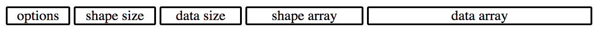

# TensorBinaryFileFormat
A file format to store tensor data structures.

#### Extension `.tnsr` and `.tensor`
#### MIME Type `application/tensor`



## options
A Uint16 number that stores all configuration settings for storage.

Using a clock-like structure we can store all the settings we need in a single number.

#### props:
  - shapeSizeType has 5 settings 0-4
  - dataSizeType has 5 settings 0-4
  - shapeArrayType has 5 settings 0-4
  - dataArrayType has 14 settings 0-13

#### 0-13 : 0-4 : 0-4 : 0-4
```javascript
// options to props
let props = {
  shapeSizeType: options % 5,
  dataSizeType: floor(options / 5) % 5,
  shapeArrayType: floor(options / 25) % 5,
  dataArrayType: floor(options / 125) % 14
}

// props to options
let options = (
  props.shapeSizeType +
  props.dataSizeType * 5 +
  props.shapeArrayType * 25 +
  props.dataArrayType * 125
)
```

## shape size
A number that stores the number of units in the shape array.

##### Type Options:
  - Uint8
  - Uint16
  - Uint32
  - Uint64
  - Uint128

## data size
A number that stores the number of units in the data array.

##### Type Options:
  - Uint8
  - Uint16
  - Uint32
  - Uint64
  - Uint128

## shape array
An array of the shape information.

##### Type Options:
  - Uint8
  - Uint16
  - Uint32
  - Uint64
  - Uint128

## data array
An array of the data information.

##### Type Options:
  - Uint8
  - Uint16
  - Uint32
  - Uint64
  - Uint128
  - Int8
  - Int16
  - Int32
  - Int64
  - Int128
  - Float16
  - Float32
  - Float64
  - Float128
